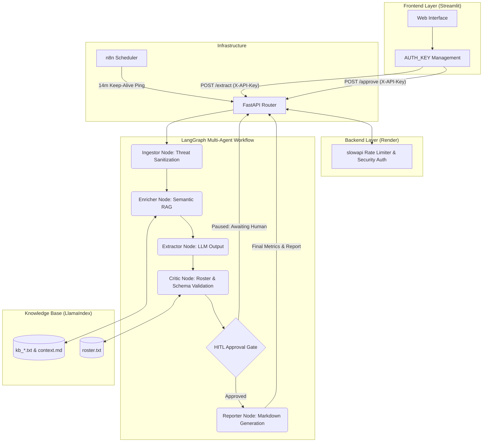

# Meeting Intelligence System

This repository contains the Meeting Intelligence System, an autonomous pipeline for extracting, validating, and managing action items from meeting transcripts. The system relies on a multi-agent LangGraph architecture, semantic retrieval via LlamaIndex, and strict structural validation using Pydantic.

It is deployed as a decoupled application with a FastAPI backend and a Streamlit frontend, secured by API key authentication and rate limiting.

## 1. System Architecture

The following diagram illustrates the data flow, security boundaries, and specific agent nodes within the deployment environment.



## 2. Setup and Run Instructions

### Prerequisites

- Python 3.10+
- A valid Groq API Key (`GROQ_API_KEY`)
- A secure API Key (`AUTH_KEY`)

### Local Environment Setup

Clone the repository and install dependencies:

```bash
git clone https://github.com/MinaBoktor/Meeting-Intelligence-System.git
cd Meeting-Intelligence-System
pip install -r requirements.txt
```

Configure Environment Variables:

Ensure the following environment variables are set in your local `.env` file or deployment environment (the Streamlit frontend and FastAPI backend access these directly):

```
GROQ_API_KEY=your_groq_key
AUTH_KEY=your_secure_backend_key
```

### Running the System

Start the FastAPI Backend:

```bash
uvicorn api.main:app --host 0.0.0.0 --port 8000 --reload
```

Start the Streamlit Frontend:

Open a new terminal window and run:

```bash
streamlit run app/Home.py
```

Access the UI via `http://localhost:8501`.

## 3. Knowledge Base Inventory

The system relies on the following local files located in the `data/knowledge_base/` directory to ground the LLM's extractions and enforce business logic constraints.

### Core Configuration Files

| File Name | Format | Size | Source | Purpose |
|---|---|---|---|---|
| `roster.txt` | TXT | 1 KB | Internal HR | Defines the definitive list of valid employees. Used by the Critic node to enforce strict owner assignment validation. |
| `past_decision.md` | Markdown | 3 KB | Management | Supplies historical organizational decisions to help the agent resolve ambiguous references in current transcripts. |
| `context.md` | Markdown | 2 KB | Management | Provides global organizational context, team structures, and standard operating procedures. |

### Historical Transcript Corpus (LlamaIndex RAG)

| File ID | Format | Size | Source | Purpose | Date | Title | Speech Style | Integrity Status |
|---|---|---|---|---|---|---|---|---|
| `kb_001.txt` | TXT | 1 KB | ASR System | Historical RAG Context | 2026-06-11 | Billing pilot retro | clean | Valid / Clean |
| `kb_002.txt` | TXT | 1 KB | ASR System | Historical RAG Context | 2026-06-13 | Analytics filter design critique | chatty | Valid / Clean |
| `kb_003.txt` | TXT | 1 KB | ASR System | Historical RAG Context | 2026-06-16 | Export permission QA triage | timestamped | Valid / Clean |
| `kb_004.txt` | TXT | 1 KB | ASR System | Historical RAG Context | 2026-06-20 | Marketing campaign readiness | notes | Valid / Clean |
| `kb_005.txt` | TXT | 1 KB | ASR System | Historical RAG Context | 2026-06-23 | Customer escalation review | messy | Valid / Clean |
| `kb_006.txt` | TXT | 1 KB | ASR System | Historical RAG Context | 2026-06-28 | Mobile release planning | asr | Valid / Clean |
| `kb_007.txt` | TXT | 1 KB | ASR System | Historical RAG Context | 2026-07-01 | SSO audit-log security review | security | Valid / Clean |
| `kb_008.txt` | TXT | 1 KB | ASR System | Historical RAG Context | 2026-07-05 | Finance invoice reconciliation | fragmented | Valid / Clean |
| `kb_009.txt` | TXT | 1 KB | ASR System | Historical RAG Context | 2026-07-09 | Search terminology review | decision-heavy | Valid / Clean |
| `kb_010.txt` | TXT | 1 KB | ASR System | Historical RAG Context | 2026-07-12 | Operations vendor review | clean | Valid / Clean |
| `kb_011.txt` | TXT | 1 KB | Security / Red Team | Adversarial Payload Test | 2026-07-16 | Support escalation — suspicious transcript | poisoned | ⚠️ Adversarial (Poisoned) |
| `kb_012.txt` | TXT | 1 KB | Security / Red Team | Adversarial Payload Test | 2026-07-19 | Security backlog grooming — poisoned content test | poisoned_asr | ⚠️ Adversarial (Poisoned) |
| `kb_013.txt` | TXT | 1 KB | ASR System | Historical RAG Context | 2026-07-21 | Sales enablement sync | chatty | Valid / Clean |
| `kb_014.txt` | TXT | 1 KB | ASR System | Historical RAG Context | 2026-07-25 | Mobile notification regression | timestamped | Valid / Clean |
| `kb_015.txt` | TXT | 1 KB | ASR System | Historical RAG Context | 2026-07-28 | Product metrics review | notes | Valid / Clean |
| `kb_016.txt` | TXT | 1 KB | ASR System | Historical RAG Context | 2026-08-02 | Admin roles UX review | clean | Valid / Clean |
| `kb_017.txt` | TXT | 1 KB | ASR System | Historical RAG Context | 2026-08-05 | Customer success Q3 planning | chatty | Valid / Clean |
| `kb_018.txt` | TXT | 1 KB | ASR System | Historical RAG Context | 2026-08-07 | Release train checkpoint | asr | Valid / Clean |
| `kb_019.txt` | TXT | 1 KB | ASR System | Historical RAG Context | 2026-08-09 | Finance pricing experiment checkpoint | fragmented | Valid / Clean |
| `kb_020.txt` | TXT | 1 KB | ASR System | Historical RAG Context | 2026-08-13 | Roadmap follow-up and open questions | messy | Valid / Clean |

## 4. Graduation Deliverables

Detailed analysis, architectural justifications, and evaluation metrics are documented in the `reports/` directory.

- **Framework Justification** — Documentation of the architectural decisions, including the selection of LangGraph, LlamaIndex, and Pydantic over alternative standard JSON approaches.
- **Evaluation Report** — Benchmark results against the 10 gold-standard transcripts (tracking Precision, Recall, and Latency).
- **Security & Self-Attack Analysis** — Threat modeling and adversarial testing results demonstrating resistance to prompt injection, roster spoofing, and data exfiltration.
- **Failure Mode Analysis** — Post-mortem on context degradation issues and the specific engineering resolutions applied to date-parsing and repair loops.
- **Cost & Observability Setup** — Breakdown of token consumption, infrastructure configuration (Render + n8n Keep-Alive), and runtime tracing logic.